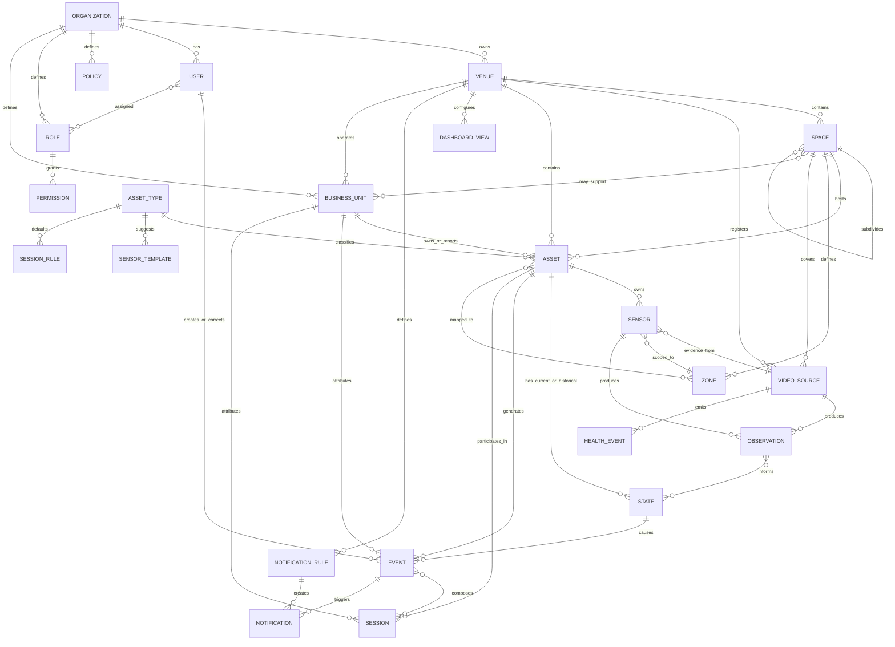

# Domain Model

## Domain Philosophy

Strikee Vision models physical operations as a chain of configured business concepts and generated operational facts.

The product should avoid hardcoded vertical terms. A "table", "station", "counter", "bay", "desk", "entrance", or "machine" is an Asset with a configured Asset Type.

## Core Domain Chain

Space (physical layout) and Business Unit (analytics attribution) are **parallel** children of Venue; they are not stacked. They cross-connect through the Asset, which carries both its Space (physical home) and its Business Unit (reporting attribution).

Organization  
to Venue  
to { Space (physical), Business Unit (reporting) }  
to Asset  
to Sensor  
to Observation  
to State  
to Event  
to Session

Physical containment and business attribution are related but separate:

Organization  
to Venue  
to Space  
to Video Source  
to Asset  
to Sensor  
to Observation  
to State  
to Event  
to Session

## Entity Dictionary

### Organization

Purpose: Represents the customer account or business group that owns one or more Venues.

Key responsibilities:

- Owns users, roles, policies, venues, and commercial settings.
- Defines organization-level defaults.
- Provides cross-venue reporting scope where enabled.

Should not contain:

- Camera-specific processing logic.
- Venue layout details.

### Venue

Purpose: Represents one physical location where operations occur.

Key responsibilities:

- Groups Spaces, Video Sources, Assets, local policies, and dashboards.
- Defines venue timezone, operating hours, retention preferences, and notification defaults.
- Serves as the primary operating scope for staff.

### Business Unit

Purpose: Represents a separately managed analytics and operational reporting unit within an Organization or Venue.

Examples:

- Snooker operation.
- Gaming lounge operation.
- Food and beverage operation.
- Warehouse receiving operation.
- Office visitor area.

Key responsibilities:

- Provides operational analytics attribution.
- Groups Assets, Sessions, Events, dashboards, and analytics for separate tracking.
- Allows multiple businesses to operate under the same Organization and Venue name.
- Supports shared Spaces, such as a passage, lobby, waiting area, reception, or entrance.

Should not contain:

- Physical layout details that belong to Space.
- Camera configuration that belongs to Video Source.
- Payment, billing, accounting, or ledger details.

Reasoning: Physical areas and analytics reporting boundaries are not always the same. A passage may serve both snooker and gaming. A single Space may contain Assets from different Business Units. A Business Unit gives clean analytics separation without duplicating the Venue.

### Space

Purpose: Represents a physical area inside a Venue.

Examples:

- Main floor.
- Reception area.
- Kitchen.
- Storage room.
- Waiting area.
- Loading bay.
- First floor.

Key responsibilities:

- Provides spatial grouping.
- Hosts Assets and Video Sources.
- Supports polygons and zones.

Clarification: Space is a physical concept, not an analytics segment. A Space may be assigned to a primary Business Unit for reporting, but Assets, Events, and Sessions should carry their own Business Unit attribution when analytics separation matters.

### Video Source

Purpose: Represents a camera feed, video stream, recorded video input, or other visual source.

Key responsibilities:

- Supplies visual input.
- Has health status.
- Can be mapped to one or more Spaces.
- Can be associated with calibration and masking settings.

Clarification: A Video Source can also be registered as an Asset if the business wants to manage camera equipment as an operational asset, but it remains a distinct source concept.

### Asset Coverage

Purpose: Represents the relationship between one or more Video Sources, Zones, and the Asset they help observe.

Key responsibilities:

- Allows one Asset to be observed by multiple Video Sources.
- Allows one Video Source to observe multiple Assets through separate Zones or polygons.
- Defines primary and supporting views where needed.
- Prevents duplicate analytics when multiple cameras observe the same Asset.

Reasoning: A physical table or station may have two camera angles. The product should still show one Asset, one current State, one Event stream, and one Session timeline for that table or station.

Realization: Asset Coverage is realized as the Asset's set of Sensor bindings, each carrying a role of primary or supporting. The primary sensor decides State; supporting sensors contribute confidence, review, and fallback when the primary is degraded or offline. Presence override: the Asset is occupied if the primary reports occupied or any supporting sensor reports occupied with high confidence (occlusion causes false empties, rarely false occupied). Weighted multi-source fusion is deferred to a later phase.

### Asset Type

Purpose: Defines a reusable category of Asset configured by the customer or product.

Examples:

- Play station.
- Table.
- Machine.
- Counter.
- Queue area.
- Shelf.
- Door.
- Work zone.
- Vehicle bay.

Key responsibilities:

- Defines allowed states.
- Defines default sensors.
- Defines default session rules.
- Defines dashboard display preferences.

### Asset

Purpose: Represents a business-relevant object, zone, station, area, or resource that can be observed, measured, assigned, or reported on.

Key responsibilities:

- Has an identifier and location.
- Belongs to a Venue and usually a Space.
- Can belong to a Business Unit for analytics and operational reporting attribution.
- Can have one or more Video Sources contributing to its coverage.
- Can be mapped to one or more Zones (each Zone owns one or more polygons).
- Can have Sensors.
- Has current State.
- Generates Events.
- May participate in Sessions.

### Zone

Purpose: Represents a configured spatial region used for observation.

Examples:

- Polygon around a table.
- Queue line area.
- Staff-only zone.
- Entry threshold.
- Occupancy region.

Key responsibilities:

- Is the only named, linkable spatial object; owns one or more polygons as its geometry. Assets and Sensors link to Zones, never to bare polygons.
- Defines where a Sensor should observe.
- Supports privacy masking.
- Can be linked to one or more Assets.

### Sensor

Purpose: Represents a configured observation capability.

Examples:

- Occupancy sensor.
- Presence sensor.
- Activity sensor.
- Inactivity sensor.
- Queue length sensor.
- Dwell sensor.
- Transition sensor.
- Obstruction sensor.
- Video health sensor.

Key responsibilities:

- Defines what should be observed.
- Defines where it observes.
- Defines sensitivity, confidence thresholds, and operating schedule.
- Produces Observations.

Important: A Sensor is not necessarily a physical device. It is often a virtual sensor powered by video analysis.

Structure and ownership: A Sensor is a first-class object that references three things — a subject (the Asset it reports on), an evidence source (a Video Source), and a spatial scope (a Zone). Its lifecycle home is the Asset; a Sensor is configured and deleted through its Asset. Space-level and passage or entry observation is handled by modeling those areas as Assets, so a Sensor's subject is always an Asset. Camera-health monitoring is a property of the Video Source, not a Sensor.

### Observation

Purpose: Represents raw or near-raw output from AI or another signal source.

Key responsibilities:

- Captures what was observed.
- Includes confidence, timestamp, source, and evidence reference.
- Does not directly change business truth.
- Feeds state derivation.

Examples:

- Person-like object detected in Zone A.
- Motion observed in polygon B.
- Queue count estimated as 5.
- Asset region appears empty.
- Camera feed unavailable.

### State

Purpose: Represents the current derived condition of an Asset, Space, Video Source, Sensor, or operational concept.

Examples:

- Available.
- Occupied.
- Idle.
- In use.
- Waiting.
- Blocked.
- Offline.
- Degraded.
- Unknown.

Key responsibilities:

- Is derived from observations, rules, and prior state.
- Has effective time.
- Has confidence and reason.
- Can generate Events when it changes.

### Event

Purpose: Represents an immutable business-relevant fact.

Examples:

- Asset became occupied.
- Asset became available.
- Queue exceeded threshold.
- Session started.
- Session ended.
- Video source went offline.
- Manual correction applied.
- Alert acknowledged.

Key responsibilities:

- Is append-only.
- Has actor or system origin.
- Links to evidence.
- Drives dashboards, analytics, notifications, and sessions.

### Session

Purpose: Represents a bounded period of operational activity involving one or more Assets.

Examples:

- A table usage period.
- A station usage period.
- A customer occupancy interval.
- A bay loading interval.
- A meeting room usage interval.

Key responsibilities:

- Starts and ends based on Events and rules.
- Can be detected, confirmed, corrected, or voided.
- Supports duration, utilization, and operational reporting.
- Carries Business Unit attribution where the participating Assets or rules define it.

Challenge: Session is a powerful abstraction, but not every Event needs a Session. The product should only create Sessions where the activity has a meaningful start, end, and business value.

### Rule

Purpose: Defines deterministic product logic for deriving State, Events, Sessions, or Notifications.

Key responsibilities:

- Converts observations into state transitions.
- Converts state transitions into Events.
- Groups Events into Sessions.
- Evaluates notification conditions.

Rules should be configurable but constrained. A fully arbitrary rule engine is likely over-engineered for early product scope.

### Policy

Purpose: Defines permissions, retention, privacy, operating hours, escalation, or review requirements.

Key responsibilities:

- Controls user and product behavior.
- Applies at organization, venue, space, asset, or sensor scope.

### User

Purpose: Represents a human who uses or administers the product.

Key responsibilities:

- Has roles and permissions, scoped by Venue in this phase.
- Performs review, configuration, correction, acknowledgement, and reporting actions.

### Notification

Purpose: Represents a delivered or pending message triggered by an Event or condition.

Key responsibilities:

- References the Event or rule that caused it.
- Has delivery channel, recipient, status, and acknowledgement lifecycle.

### Dashboard View

Purpose: Represents a configured operational view for a role or Venue.

Key responsibilities:

- Shows current states, Events, Sessions, notifications, and KPIs.
- Adapts to configured Assets and Spaces.

## Conceptual ERD

This is conceptual only. It does not imply SQL, NoSQL, table structure, indexes, storage engine, or persistence technology.

ERD notes:

- A Sensor is owned by its Asset and references one Video Source (evidence) and one Zone (scope). Its primary or supporting role realizes Asset Coverage; no separate coverage entity is required.
- Camera health is emitted by the Video Source, not by a Sensor.
- Roles are scoped by Venue in this phase; Business-Unit-scoped permissions are planned for a later phase.

## State Model Guidance

State is a small structured object with three independent facets, each carrying its own value, confidence, and effective time:

- presence: absent, present, or unknown.
- activity: active, inactive, or unknown.
- health: ok, degraded, or offline.

The dashboard shows one derived display label from the facets, with health taking priority (a degraded or offline source never shows a confident business status). Recommended mapping:

- health degraded or offline: Unknown or Degraded.
- present and active: Active (In Use).
- present and inactive: Occupied – Idle.
- absent: Available.
- otherwise: Unknown.

Rationale: presence and activity are independent axes — someone can be present but not actively playing — so a single flat status enum cannot represent both. Health is kept separate so it can never corrupt business status.

The former flat labels remain useful as the set of derived display labels:

- Unknown: Product cannot determine state.
- Available: Asset is ready and not in use.
- Occupied: Asset appears to be in use or occupied.
- Active: Meaningful activity is detected.
- Idle: Asset is not active but may not be available.
- Waiting: Activity is pending service or next action.
- Blocked: Asset or area is obstructed.
- Offline: Source or sensor is unavailable.
- Degraded: Confidence, health, or visibility is below acceptable threshold.

Each Asset Type may define which display labels apply, but the underlying facets should be reused where possible.

## Event Model Guidance

Each Event should include:

- Event type.
- Scope.
- Subject.
- Timestamp.
- Effective time.
- Origin.
- Rule context.
- Confidence where applicable.
- Evidence reference where applicable.
- Actor where applicable.
- Correlation id where applicable.
- Immutable payload.

Events should be append-only. Corrections should be modeled as new Events.

## Session Model Guidance

Sessions should include:

- Session type.
- Start Event.
- End Event where available.
- Participating Asset (single Asset in this phase).
- Venue and Space.
- Business Unit attribution (inherited from the Asset).
- Start time.
- End time.
- Duration.
- Detection confidence.
- Status: detected, confirmed, corrected, voided.
- Evidence references.
- Correction history through Events.

Session semantics: Sessions are materialized records (built from Events, not recomputed on every read). A session opens when presence or activity holds for the Asset Type's configured minimum start duration, and closes after it clears for the configured minimum clear duration — a grace window that absorbs brief blips and inter-camera clock drift. After a session closes, late activity does not reopen it: genuine new activity starts a new session, and a human may merge sessions with a correction Event. In this phase a session belongs to exactly one Asset and therefore one Business Unit; shared areas such as a passage are their own neutral-Business-Unit sessions. Corrections are append-only and preserve original values.

## Object Complexity Test

Before adding a new object, ask:

- Does it represent something users configure, observe, decide from, or report on?
- Does it reduce ambiguity in the product?
- Can it be explained to an operator?
- Does it avoid hardcoding a vertical-specific concept?
- Would removing it make the product less auditable or less useful?

If the answer is mostly no, reject the object for now.
