# Product Architecture Diagrams

These diagrams describe product concepts, user workflows, and business object relationships. They are not infrastructure diagrams and do not imply technology choices.

Note: several concepts were refined after these diagrams were first drawn — State now carries presence, activity, and health facets; a Sensor is owned by its Asset and references one Video Source (evidence) and one Zone (scope); Assets and Sensors link to Zones rather than bare polygons; and analytics also draw on Metric Samples. Where a flow diagram lags these refinements, the [Gaps and Open Questions](17-gaps-and-open-questions.md) document and the [Decision Log](13-decision-log.md) govern. The conceptual entity relationship diagram below (Diagram 25) has been updated to match.

## Diagram 1: Product Overview

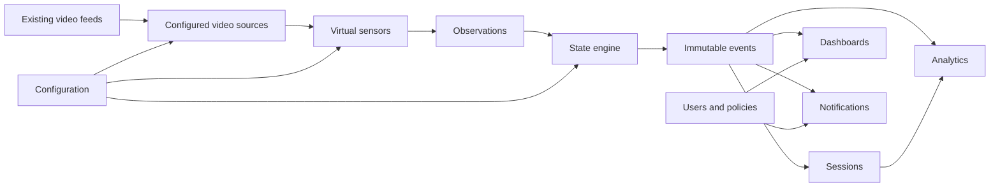
```mermaid
flowchart LR
    A[Existing video feeds] --> B[Configured video sources]
    B --> C[Virtual sensors]
    C --> D[Observations]
    D --> E[State engine]
    E --> F[Immutable events]
    F --> G[Sessions]
    F --> H[Dashboards]
    F --> I[Notifications]
    F --> J[Analytics]
    G --> J
    K[Users and policies] --> H
    K --> I
    L[Configuration] --> B
    L --> C
    L --> E
```

## Diagram 2: Core Domain Chain

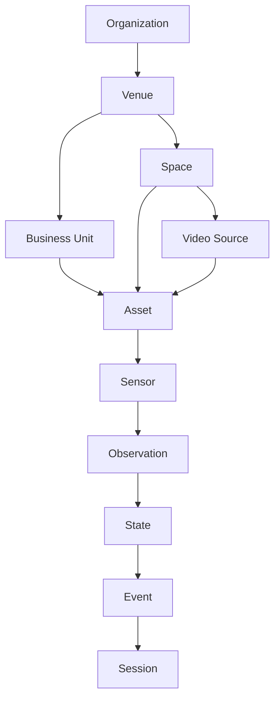
```mermaid
flowchart TD
    Organization --> Venue
    Venue --> BusinessUnit[Business Unit]
    Venue --> Space
    BusinessUnit --> Asset
    Space --> VideoSource[Video Source]
    Space --> Asset
    VideoSource --> Asset
    Asset --> Sensor
    Sensor --> Observation
    Observation --> State
    State --> Event
    Event --> Session
```

## Diagram 3: Physical Hierarchy

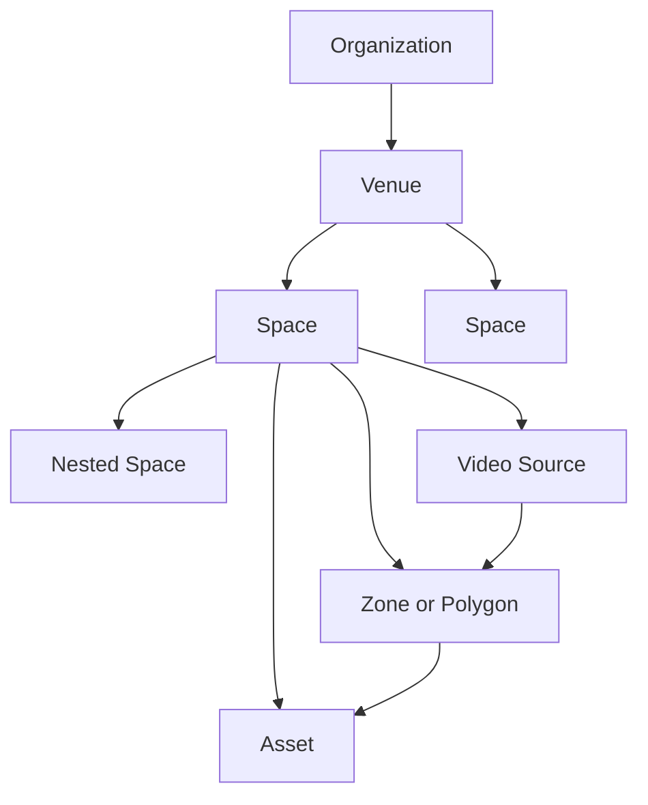
```mermaid
flowchart TD
    Org[Organization]
    Org --> VenueA[Venue]
    VenueA --> SpaceA[Space]
    VenueA --> SpaceB[Space]
    SpaceA --> SubSpaceA[Nested Space]
    SpaceA --> VideoA[Video Source]
    SpaceA --> AssetA[Asset]
    SpaceA --> ZoneA[Zone or Polygon]
    ZoneA --> AssetA
    VideoA --> ZoneA
```

## Diagram 4: Operational Hierarchy

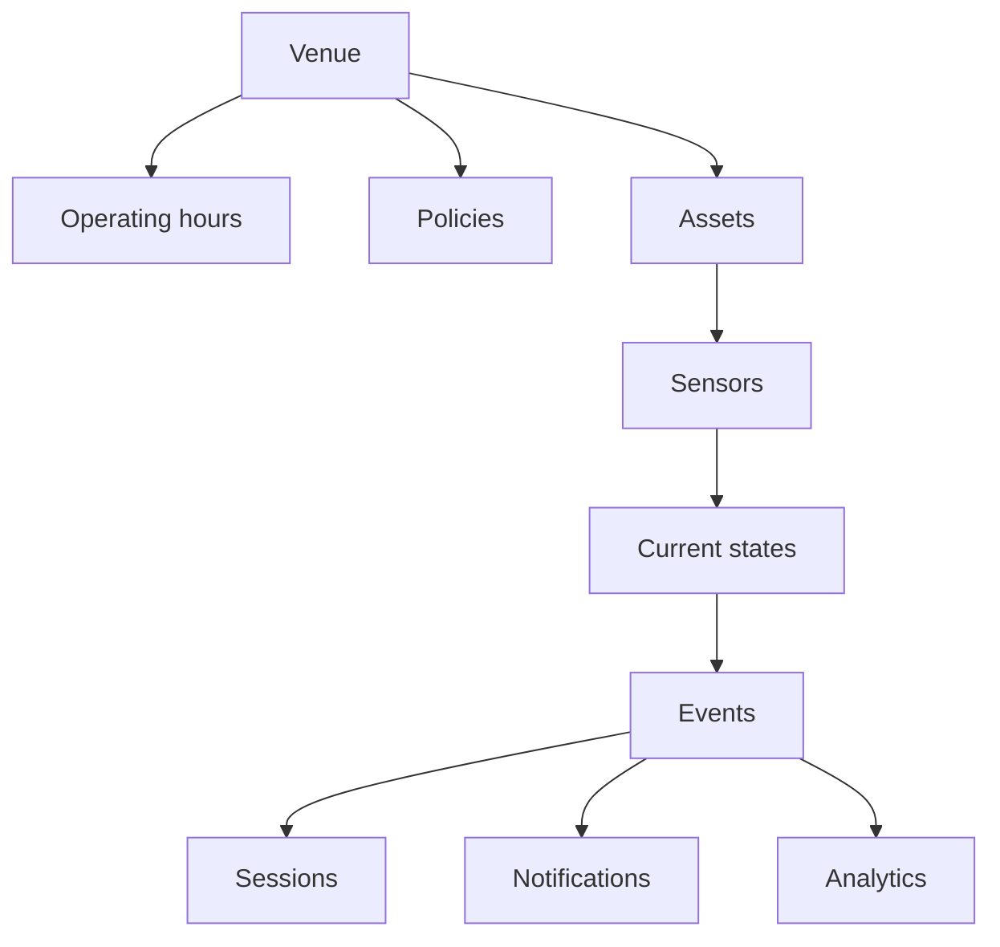
```mermaid
flowchart TD
    Venue --> OperatingHours[Operating hours]
    Venue --> Policies[Policies]
    Venue --> Assets[Assets]
    Assets --> Sensors[Sensors]
    Sensors --> States[Current states]
    States --> Events[Events]
    Events --> Sessions[Sessions]
    Events --> Notifications[Notifications]
    Events --> Analytics[Analytics]
```

## Diagram 5: Ownership Model

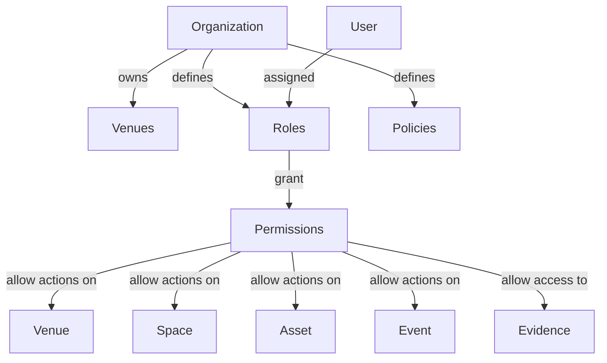
```mermaid
flowchart TD
    Organization -->|owns| Venues
    Organization -->|defines| Roles
    Organization -->|defines| Policies
    User -->|assigned| Roles
    Roles -->|grant| Permissions
    Permissions -->|allow actions on| Venue
    Permissions -->|allow actions on| Space
    Permissions -->|allow actions on| Asset
    Permissions -->|allow actions on| Event
    Permissions -->|allow access to| Evidence
```

## Diagram 6: Configuration Hierarchy

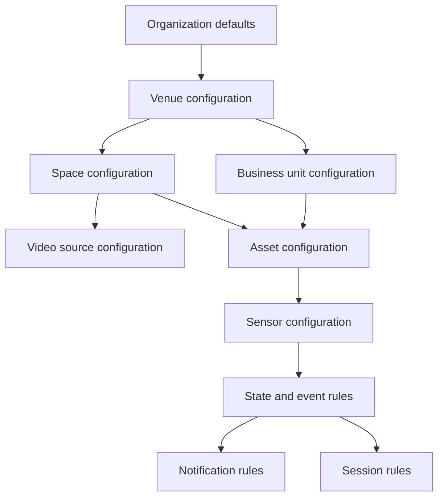
```mermaid
flowchart TD
    OrgDefaults[Organization defaults] --> VenueConfig[Venue configuration]
    VenueConfig --> SpaceConfig[Space configuration]
    VenueConfig --> BusinessUnitConfig[Business unit configuration]
    SpaceConfig --> VideoConfig[Video source configuration]
    SpaceConfig --> AssetConfig[Asset configuration]
    BusinessUnitConfig --> AssetConfig
    AssetConfig --> SensorConfig[Sensor configuration]
    SensorConfig --> RuleConfig[State and event rules]
    RuleConfig --> NotificationConfig[Notification rules]
    RuleConfig --> SessionConfig[Session rules]
```

## Diagram 7: Observation Flow

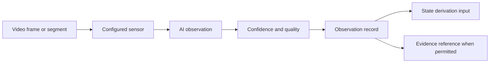
```mermaid
flowchart LR
    Frame[Video frame or segment] --> Sensor[Configured sensor]
    Sensor --> AI[AI observation]
    AI --> Confidence[Confidence and quality]
    Confidence --> Observation[Observation record]
    Observation --> StateInput[State derivation input]
    Observation --> Audit[Evidence reference when permitted]
```

## Diagram 8: State Derivation Flow

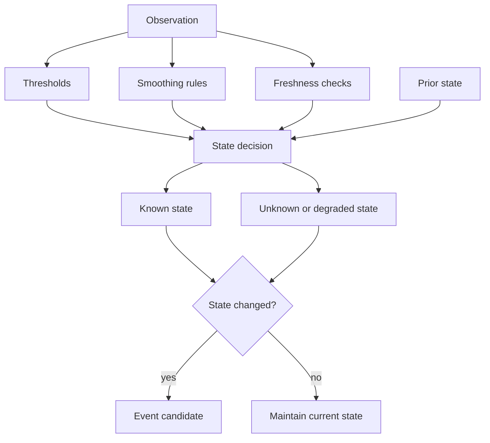
```mermaid
flowchart TD
    Observation --> Thresholds[Thresholds]
    Observation --> Smoothing[Smoothing rules]
    Observation --> Freshness[Freshness checks]
    Thresholds --> StateDecision[State decision]
    Smoothing --> StateDecision
    Freshness --> StateDecision
    PriorState[Prior state] --> StateDecision
    StateDecision --> KnownState[Known state]
    StateDecision --> UnknownState[Unknown or degraded state]
    KnownState --> StateChange{State changed?}
    UnknownState --> StateChange
    StateChange -->|yes| EventCandidate[Event candidate]
    StateChange -->|no| CurrentState[Maintain current state]
```

## Diagram 9: Event Flow

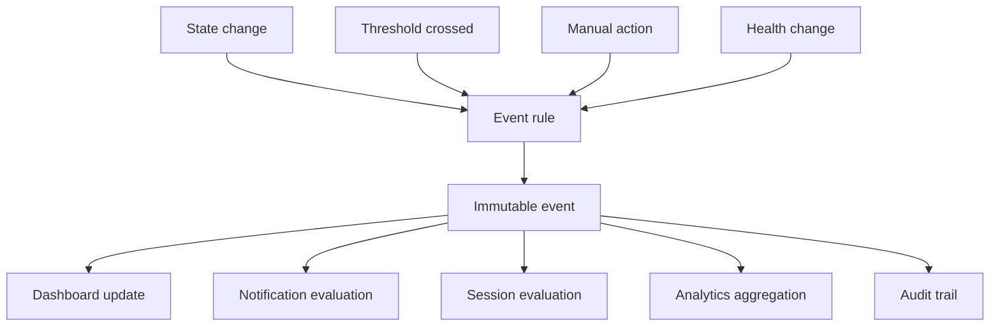
```mermaid
flowchart TD
    StateChange[State change] --> Rule[Event rule]
    Threshold[Threshold crossed] --> Rule
    ManualAction[Manual action] --> Rule
    HealthChange[Health change] --> Rule
    Rule --> Event[Immutable event]
    Event --> Dashboard[Dashboard update]
    Event --> NotificationCheck[Notification evaluation]
    Event --> SessionCheck[Session evaluation]
    Event --> Analytics[Analytics aggregation]
    Event --> AuditTrail[Audit trail]
```

## Diagram 10: Session Flow

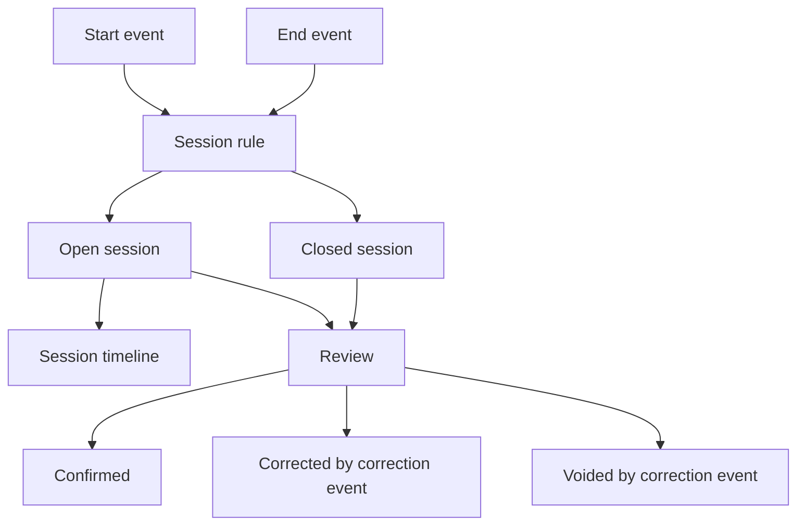
```mermaid
flowchart TD
    StartEvent[Start event] --> SessionRule[Session rule]
    SessionRule --> OpenSession[Open session]
    OpenSession --> Timeline[Session timeline]
    EndEvent[End event] --> SessionRule
    SessionRule --> ClosedSession[Closed session]
    OpenSession --> Review[Review]
    ClosedSession --> Review
    Review --> Confirmed[Confirmed]
    Review --> Corrected[Corrected by correction event]
    Review --> Voided[Voided by correction event]
```

## Diagram 11: Asset Lifecycle

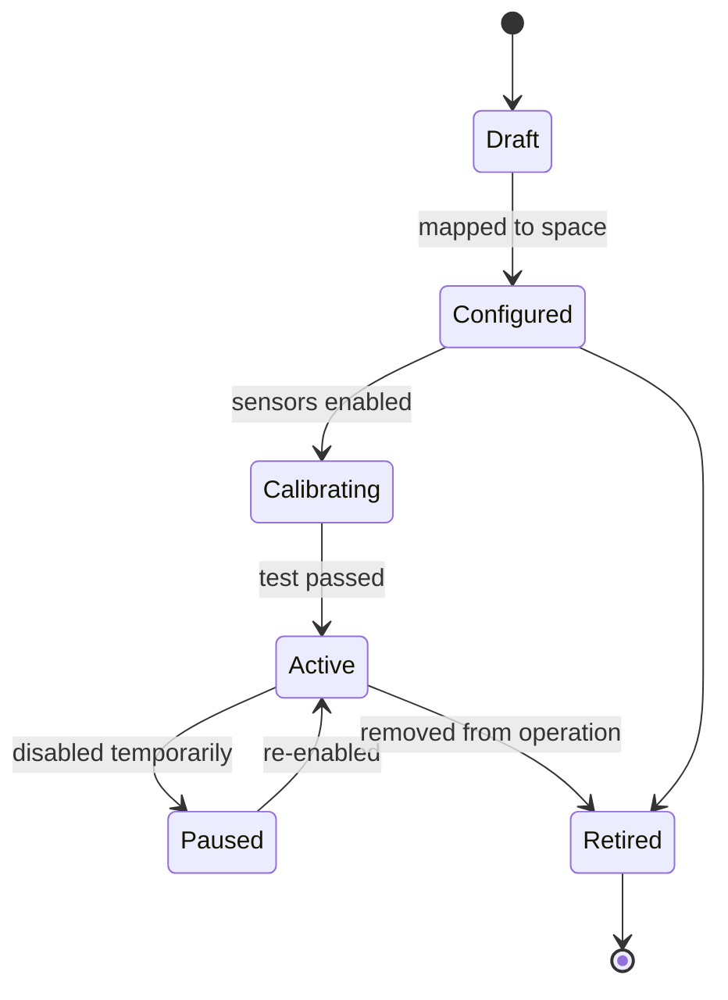
```mermaid
stateDiagram-v2
    [*] --> Draft
    Draft --> Configured: mapped to space
    Configured --> Calibrating: sensors enabled
    Calibrating --> Active: test passed
    Active --> Paused: disabled temporarily
    Paused --> Active: re-enabled
    Active --> Retired: removed from operation
    Configured --> Retired
    Retired --> [*]
```

## Diagram 12: Video Source Lifecycle

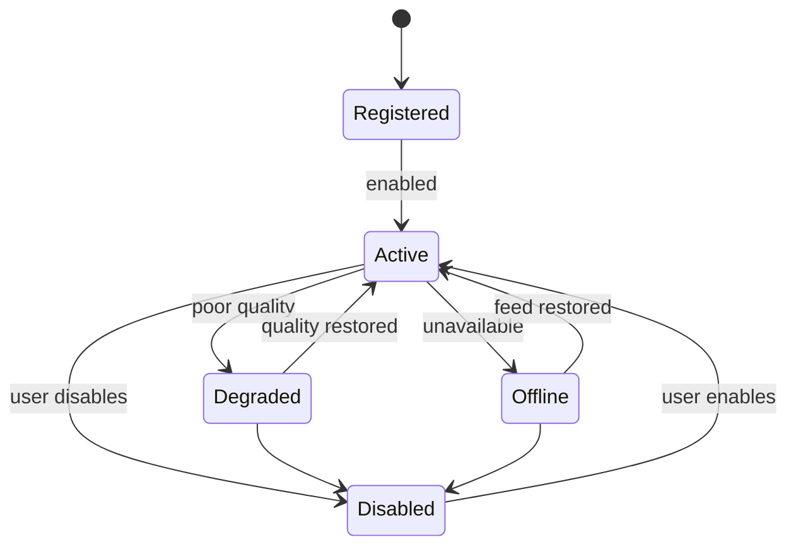
```mermaid
stateDiagram-v2
    [*] --> Registered
    Registered --> Active: enabled
    Active --> Degraded: poor quality
    Active --> Offline: unavailable
    Degraded --> Active: quality restored
    Offline --> Active: feed restored
    Active --> Disabled: user disables
    Degraded --> Disabled
    Offline --> Disabled
    Disabled --> Active: user enables
```

## Diagram 13: Sensor Lifecycle

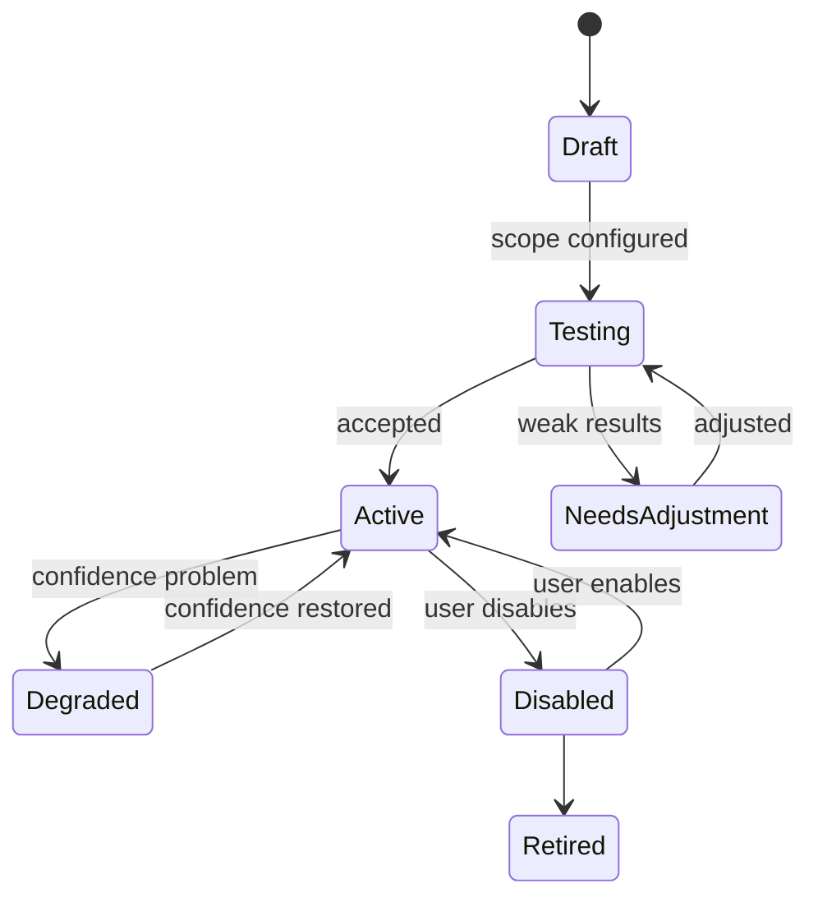
```mermaid
stateDiagram-v2
    [*] --> Draft
    Draft --> Testing: scope configured
    Testing --> Active: accepted
    Testing --> NeedsAdjustment: weak results
    NeedsAdjustment --> Testing: adjusted
    Active --> Degraded: confidence problem
    Degraded --> Active: confidence restored
    Active --> Disabled: user disables
    Disabled --> Active: user enables
    Disabled --> Retired
```

## Diagram 14: Polygon Workflow

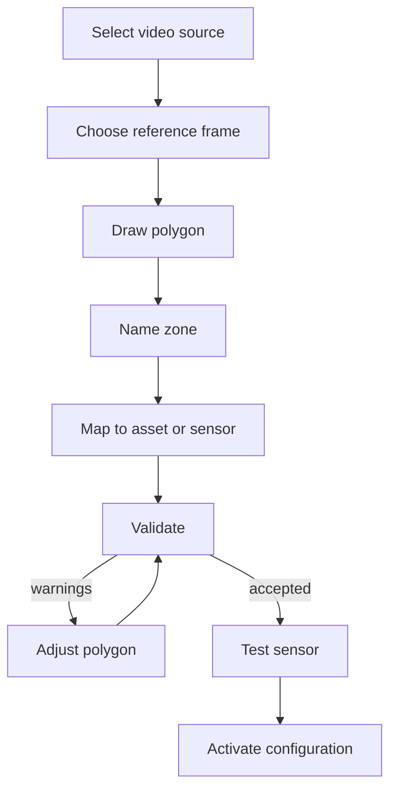
```mermaid
flowchart TD
    SelectSource[Select video source] --> CaptureFrame[Choose reference frame]
    CaptureFrame --> Draw[Draw polygon]
    Draw --> NameZone[Name zone]
    NameZone --> MapAsset[Map to asset or sensor]
    MapAsset --> Validate[Validate]
    Validate -->|warnings| Adjust[Adjust polygon]
    Adjust --> Validate
    Validate -->|accepted| Test[Test sensor]
    Test --> Activate[Activate configuration]
```

## Diagram 15: Privacy Workflow

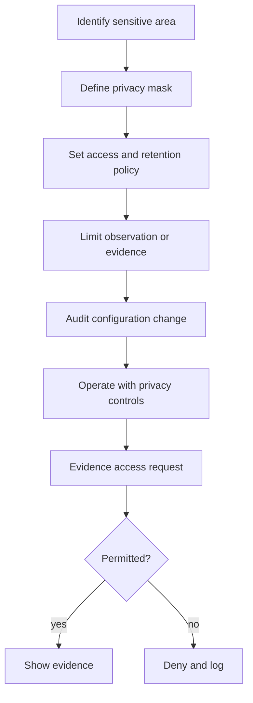
```mermaid
flowchart TD
    IdentifySensitive[Identify sensitive area] --> DefineMask[Define privacy mask]
    DefineMask --> SetPolicy[Set access and retention policy]
    SetPolicy --> ApplyObservationLimit[Limit observation or evidence]
    ApplyObservationLimit --> AuditChange[Audit configuration change]
    AuditChange --> Operate[Operate with privacy controls]
    Operate --> EvidenceRequest[Evidence access request]
    EvidenceRequest --> PermissionCheck{Permitted?}
    PermissionCheck -->|yes| ShowEvidence[Show evidence]
    PermissionCheck -->|no| DenyAccess[Deny and log]
```

## Diagram 16: Dashboard Flow

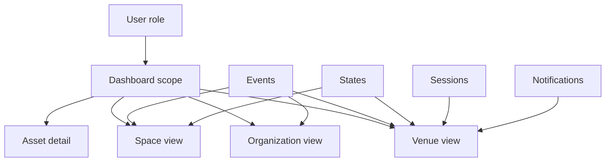
```mermaid
flowchart TD
    UserRole[User role] --> DashboardScope[Dashboard scope]
    DashboardScope --> OrgView[Organization view]
    DashboardScope --> VenueView[Venue view]
    DashboardScope --> SpaceView[Space view]
    DashboardScope --> AssetView[Asset detail]
    Events[Events] --> OrgView
    Events --> VenueView
    Events --> SpaceView
    States[States] --> VenueView
    States --> SpaceView
    Sessions[Sessions] --> VenueView
    Notifications[Notifications] --> VenueView
```

## Diagram 17: Analytics Flow

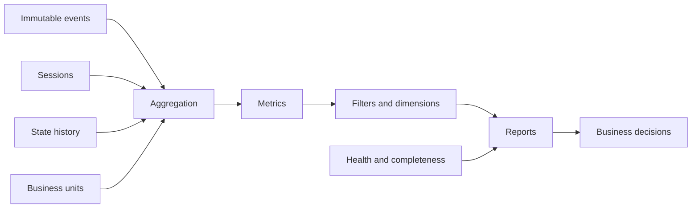
```mermaid
flowchart LR
    Events[Immutable events] --> Aggregation[Aggregation]
    Sessions[Sessions] --> Aggregation
    States[State history] --> Aggregation
    BusinessUnits[Business units] --> Aggregation
    Aggregation --> Metrics[Metrics]
    Metrics --> Filters[Filters and dimensions]
    Filters --> Reports[Reports]
    Reports --> Decisions[Business decisions]
    Health[Health and completeness] --> Reports
```

## Diagram 18: Notification Flow

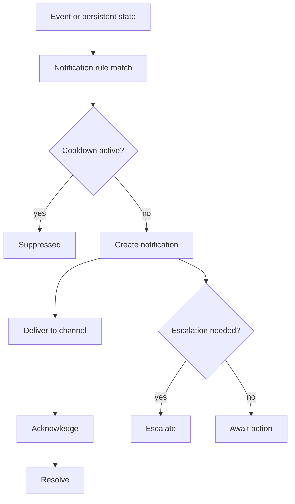
```mermaid
flowchart TD
    Event[Event or persistent state] --> RuleMatch[Notification rule match]
    RuleMatch --> Cooldown{Cooldown active?}
    Cooldown -->|yes| Suppressed[Suppressed]
    Cooldown -->|no| CreateNotification[Create notification]
    CreateNotification --> Deliver[Deliver to channel]
    Deliver --> Acknowledge[Acknowledge]
    Acknowledge --> Resolve[Resolve]
    CreateNotification --> EscalationCheck{Escalation needed?}
    EscalationCheck -->|yes| Escalate[Escalate]
    EscalationCheck -->|no| AwaitAction[Await action]
```

## Diagram 19: Review and Correction Flow

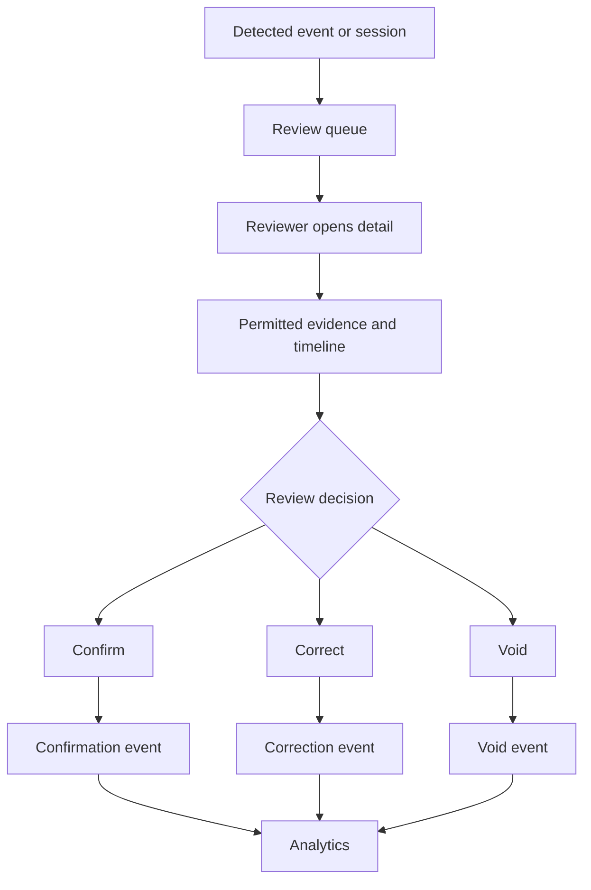
```mermaid
flowchart TD
    DetectedFact[Detected event or session] --> ReviewQueue[Review queue]
    ReviewQueue --> Reviewer[Reviewer opens detail]
    Reviewer --> Evidence[Permitted evidence and timeline]
    Evidence --> Decision{Review decision}
    Decision --> Confirm[Confirm]
    Decision --> Correct[Correct]
    Decision --> Void[Void]
    Confirm --> ConfirmationEvent[Confirmation event]
    Correct --> CorrectionEvent[Correction event]
    Void --> VoidEvent[Void event]
    ConfirmationEvent --> Analytics[Analytics]
    CorrectionEvent --> Analytics
    VoidEvent --> Analytics
```

## Diagram 20: First Venue Setup Journey

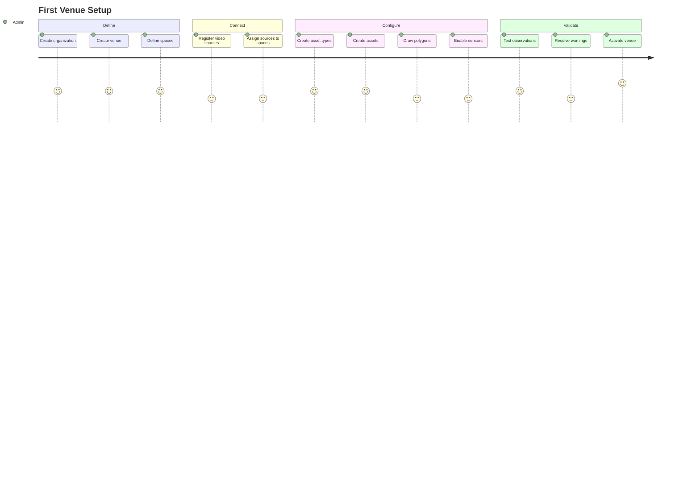
```mermaid
journey
    title First Venue Setup
    section Define
      Create organization: 4: Admin
      Create venue: 4: Admin
      Define spaces: 4: Admin
    section Connect
      Register video sources: 3: Admin
      Assign sources to spaces: 3: Admin
    section Configure
      Create asset types: 4: Admin
      Create assets: 4: Admin
      Draw polygons: 3: Admin
      Enable sensors: 3: Admin
    section Validate
      Test observations: 4: Admin
      Resolve warnings: 3: Admin
      Activate venue: 5: Admin
```

## Diagram 21: Live Operations Journey

```mermaid
journey
    title Live Operations
    section Monitor
      Open venue dashboard: 5: Manager
      Scan asset states: 5: Manager
      Review active sessions: 4: Manager
    section Act
      Receive notification: 4: Staff
      Open event detail: 4: Staff
      Acknowledge issue: 5: Staff
    section Resolve
      Condition clears: 4: Staff
      Resolution recorded: 5: Manager
```

## Diagram 22: Session Review Journey

```mermaid
journey
    title Session Review
    section Inspect
      Open review queue: 4: Reviewer
      Select session: 4: Reviewer
      Inspect timeline: 4: Reviewer
    section Decide
      Confirm session: 5: Reviewer
      Correct session time: 3: Reviewer
      Void false session: 3: Reviewer
    section Outcome
      Correction event created: 5: Reviewer
      Analytics updated: 5: Manager
```

## Diagram 23: Health Failure Journey

```mermaid
flowchart TD
    Normal[Normal source health] --> Failure[Source or sensor degrades]
    Failure --> HealthState[Health state changes]
    HealthState --> HealthEvent[Health event created]
    HealthEvent --> Impact[Impacted assets marked unknown or degraded]
    HealthEvent --> Notify[Notify responsible users]
    Notify --> Fix[User investigates and fixes]
    Fix --> Recovery[Recovery event created]
    Recovery --> Resume[States resume normal derivation]
```

## Diagram 24: Module Overview

```mermaid
flowchart TD
    Config[Configuration]
    Config --> VenueModule[Venue and space management]
    Config --> SourceModule[Video source management]
    Config --> AssetModule[Asset management]
    Config --> SensorModule[Sensor configuration]
    SensorModule --> ObservationModule[Observation handling]
    ObservationModule --> StateModule[State derivation]
    StateModule --> EventModule[Event management]
    EventModule --> SessionModule[Session management]
    EventModule --> NotificationModule[Notification management]
    EventModule --> AnalyticsModule[Analytics]
    EventModule --> DashboardModule[Dashboards]
    PolicyModule[Policy and privacy] --> Config
    PolicyModule --> DashboardModule
    ReviewModule[Review and correction] --> EventModule
    ReviewModule --> SessionModule
```

## Diagram 25: Conceptual Entity Relationship

```mermaid
erDiagram
    ORGANIZATION ||--o{ VENUE : owns
    ORGANIZATION ||--o{ USER : has
    ORGANIZATION ||--o{ ROLE : defines
    ORGANIZATION ||--o{ BUSINESS_UNIT : defines
    VENUE ||--o{ SPACE : contains
    VENUE ||--o{ VIDEO_SOURCE : registers
    VENUE ||--o{ ASSET : contains
    VENUE ||--o{ BUSINESS_UNIT : operates
    SPACE ||--o{ ZONE : defines
    SPACE ||--o{ ASSET : hosts
    SPACE }o--o{ BUSINESS_UNIT : may_support
    ASSET_TYPE ||--o{ ASSET : classifies
    ASSET ||--o{ SENSOR : owns
    ASSET }o--o{ ZONE : mapped_to
    SENSOR }o--|| VIDEO_SOURCE : evidence_from
    SENSOR }o--|| ZONE : scoped_to
    BUSINESS_UNIT ||--o{ ASSET : owns_or_reports
    BUSINESS_UNIT ||--o{ EVENT : attributes
    BUSINESS_UNIT ||--o{ SESSION : attributes
    SENSOR ||--o{ OBSERVATION : produces
    OBSERVATION }o--o{ STATE : informs
    STATE ||--o{ EVENT : causes
    EVENT }o--o{ SESSION : composes
    EVENT ||--o{ NOTIFICATION : triggers
    USER }o--o{ ROLE : assigned
```
